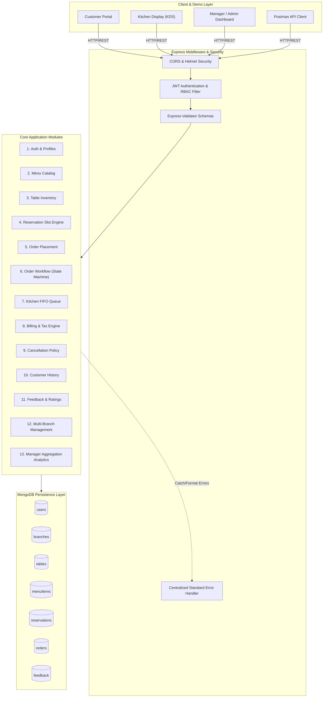
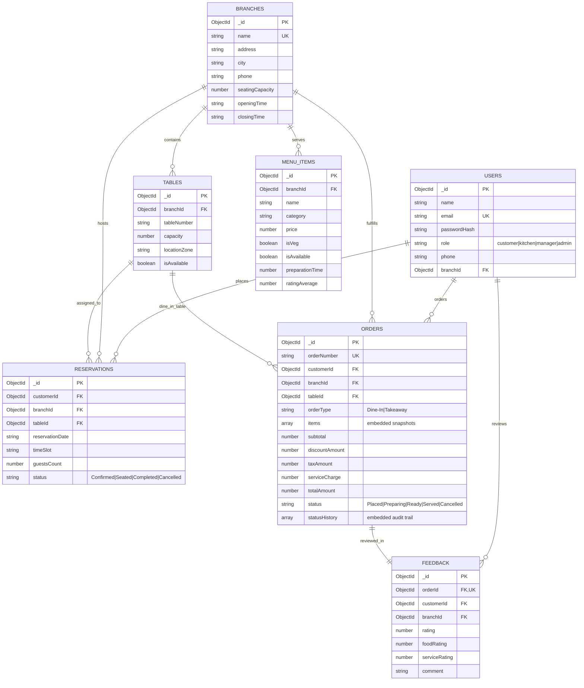

# P07 — Restaurant Table Reservation & Food Ordering System

**Domain:** Food & Beverage  
**Course:** 5th Semester • Christ University • CIA-3 Project Development  
**Confidentiality:** Academic Evaluation & Demonstration  

---

## 👥 Team Details

| Name | Roll Number | Department | Section |
|---|---|---|---|
| **Alicia Theresa Pereira** | *2462028* | Artificial Intelligence and Data Science Engineering | 5 BTCS AIML - C |
| **Alan Baiju K** | *2462022* | Artificial Intelligence and Data Science Engineering | 5 BTCS AIML - C |
| **Albert John A** | *2462025* | Artificial Intelligence and Data Science Engineering | 5 BTCS AIML - C |
| ***Ahaon Sarkar** | *2462019* | Artificial Intelligence and Data Science Engineering | 5 BTCS AIML - C |

---

## 📌 Problem Statement

In the modern hospitality industry, traditional manual restaurant operations lead to table double-booking conflicts, high table turnaround latency, order miscommunications between the dining room and kitchen, and lack of real-time insights into dish profitability and peak traffic periods. 

**The Royal Bistro** is a scalable, role-restricted, multi-branch backend and web platform that empowers customers to browse live categorized menus, reserve dining table slots with automated conflict detection, and place dine-in/takeaway orders. The backend orchestrates a real-time **Kitchen Display System (KDS)** queue for kitchen staff, enforces strict order status state transitions (`Placed` ➔ `Preparing` ➔ `Ready` ➔ `Served`), calculates accurate itemized billing (including GST and service charges), and equips managers with executive MongoDB aggregation analytics on daily revenue, dish popularity, and peak dining hours.

---

## 🛠️ Tech Stack

- **Runtime & Framework:** Node.js (v18+) with Express.js (v4.x)
- **Database & ODM:** MongoDB with Mongoose ODM (v8.x)
- **Database Resilience:** In-Memory MongoDB auto-fallback (`mongodb-memory-server`) for zero-config demo/tests + Standard MongoDB / Atlas support
- **Authentication & Security:** JSON Web Tokens (JWT), bcrypt.js password hashing, Helmet security headers, CORS
- **Validation:** Express-Validator schema validation middleware
- **Frontend / Live Demo UI:** Vanilla HTML5, CSS3 Glassmorphism, Modern JavaScript (ES6+), FontAwesome Icons, Chart.js for executive analytics
- **Testing & Tooling:** Jest, Supertest, Postman Collection v2.1 export, Morgan HTTP logger

---

## 🏗️ System Architecture & Workflow



---

## 🗄️ Entity Relationship (ER) & Schema Design Justifications



### Reference vs. Embedding Architecture Decisions

1. **Embedded Line Items inside `orders` (`items[]`)**:
   - *Reasoning:* When an order is created, menu item pricing, item names, and special cooking instructions must be frozen as immutable snapshots. If a chef updates a dish price next month, historical customer receipts must never change. Embedding ensures atomic single-document reads without joining `menuItems`.
2. **Embedded Status Audit Trail inside `orders` (`statusHistory[]`)**:
   - *Reasoning:* An order's lifecycle (`Placed` ➔ `Preparing` ➔ `Ready` ➔ `Served`) is strictly read and updated together with the order document. Keeping timestamps, status names, and staff IDs embedded avoids multi-collection writes.
3. **Referencing for `users`, `branches`, and `tables`**:
   - *Reasoning:* Entities like branches and tables have independent lifecycles, can scale to thousands of records, and are shared across thousands of reservations and orders. Referencing prevents unbounded document growth and duplication anomalies.

---

## 📦 Implemented Functional Modules (All 13 Modules)

| # | Module | Key Capabilities | API Prefix |
|---|---|---|---|
| **1** | **Customer Registration & Auth** | JWT issuance, bcrypt hash, profile update, role checks (`customer`, `kitchen`, `manager`, `admin`). | `/api/auth` |
| **2** | **Menu Management** | Multi-category CRUD, dietary tags (Veg/Non-Veg), price updates, prep time, and live availability toggling. | `/api/menu` |
| **3** | **Table Inventory Management** | Table capacities (2–10 seats), zone grouping (Indoor, Patio, Rooftop, VIP), and active status tracking. | `/api/tables` |
| **4** | **Table Reservation Engine** | Date/slot conflict detection to prevent double-booking. Auto-allocates best-fit table based on party size. | `/api/reservations` |
| **5** | **Food Order Placement** | Place Dine-In (linked to table) or Takeaway orders with custom preparation instructions. | `/api/orders` |
| **6** | **Order Status Workflow** | State machine: `Placed` ➔ `Preparing` ➔ `Ready` ➔ `Served` / `Delivered` with transition validation. | `/api/orders/:id/status` |
| **7** | **Kitchen Display Queue (KDS)** | Real-time FIFO order queue with prep countdowns, urgent ticket alerts, and 1-click status advances. | `/api/kitchen` |
| **8** | **Billing & Order Summary** | Subtotal, discounts (`WELCOME10`, `FEAST20`), GST (5%), service charge (5%), and payment tracking. | `/api/billing` |
| **9** | **Reservation Cancellation Policy** | Grace period cancellation & rescheduling policy; updates table slot availability and logs audit reasons. | `/api/reservations/:id/cancel` |
| **10** | **Customer Order History** | Customer query endpoints for past orders, detailed item receipts, and re-ordering history. | `/api/orders/my-history` |
| **11** | **Feedback & Rating Module** | Post-meal reviews (1–5 stars for food and service, comments); auto-updates dish rating averages. | `/api/feedback` |
| **12** | **Branch Management** | Multi-branch CRUD (operating hours, location addresses, total branch seating capacity). | `/api/branches` |
| **13** | **Manager Reports & Analytics** | MongoDB `$group`, `$facet`, `$unwind` pipelines for sales revenue, popular dishes, and peak hours. | `/api/reports` |

---

## 🚀 Quick Setup & Execution

### Prerequisites
- Node.js (v18.0 or higher)
- npm (v9.0 or higher)
- *(Optional)* Local MongoDB running on port 27017 or MongoDB Atlas connection string. If no database is detected, the server **automatically starts an In-Memory MongoDB instance** so you can run the project immediately with zero configuration!

### 1. Clone & Install Dependencies
```bash
# Navigate to project directory
cd scratch/restaurant-system

# Install all dependencies
npm install
```

### 2. Environment Configuration
The repository includes a pre-configured `.env` file:
```env
PORT=5000
NODE_ENV=development
MONGODB_URI=mongodb://localhost:27017/restaurant_db
JWT_SECRET=super_secret_jwt_restaurant_key_2026_jwt_token
JWT_EXPIRE=24h
TAX_RATE=0.05
SERVICE_CHARGE_RATE=0.05
```

### 3. Seed Database with Realistic Data
Populate realistic branches, tables, rich menu dishes, sample reservations, active orders across all lifecycle states, and customer reviews:
```bash
npm run seed
```

### 4. Run Automated Test Suite
Execute the Jest integration test suite covering all 13 modules:
```bash
npm test
```

### 5. Launch the Server & Interactive Web UI
```bash
npm start
# Server will be accessible at http://localhost:5000
```
Open your browser to `http://localhost:5000` to interact with the full Single Page Application dashboard!

---

## 🔑 Pre-Seeded Demo User Accounts

| Persona | Email | Password | Role | Permissions |
|---|---|---|---|---|
| **System Administrator** | `admin@restaurant.com` | `admin123` | `admin` | Full system access, branch creation, all reports |
| **Indiranagar Manager** | `manager@restaurant.com` | `manager123` | `manager` | Menu CRUD, Table CRUD, Sales analytics, order management |
| **Kitchen Head Chef** | `kitchen@restaurant.com` | `kitchen123` | `kitchen` | Live KDS queue, ticket timer, status advancement, availability toggle |
| **Customer (John)** | `john@example.com` | `customer123` | `customer` | Table reservation, menu cart, order placement, reviews |
| **Customer (Sarah)** | `sarah@example.com` | `customer123` | `customer` | Table reservation, takeaway orders |

---

## 📚 REST API Reference

### 1. Authentication & Users
- `POST /api/auth/register` — Register a new user (Public)
- `POST /api/auth/login` — Authenticate and receive JWT (Public)
- `GET /api/auth/profile` — Get current profile (Customer/Kitchen/Manager/Admin)
- `PUT /api/auth/profile` — Update current profile (Authenticated)
- `GET /api/auth/users` — List all registered users (Admin only)

### 2. Branch Management
- `GET /api/branches` — List all restaurant branches (Public)
- `GET /api/branches/:id` — Get single branch details (Public)
- `POST /api/branches` — Create a new branch (Admin only)
- `PUT /api/branches/:id` — Update branch details (Manager/Admin)
- `DELETE /api/branches/:id` — Deactivate a branch (Admin only)

### 3. Table Inventory Management
- `GET /api/tables` — Query tables by branch and capacity (Public/Authenticated)
- `GET /api/tables/available` — Query available unreserved tables for a slot (Public/Authenticated)
- `GET /api/tables/zones` — Get dining zones list (Public)
- `POST /api/tables` — Create new table (Manager/Admin)
- `PUT /api/tables/:id` — Update table details (Manager/Admin)
- `DELETE /api/tables/:id` — Soft-delete table (Manager/Admin)

### 4. Menu Management
- `GET /api/menu` — Browse menu dishes with category, veg, and search filters (Public)
- `GET /api/menu/categories` — Get category list (Public)
- `GET /api/menu/:id` — Get single dish by ID (Public)
- `POST /api/menu` — Create menu item (Manager/Admin)
- `PUT /api/menu/:id` — Update dish details (Manager/Admin)
- `PATCH /api/menu/:id/toggle-availability` — Toggle item availability on/off (Kitchen/Manager/Admin)
- `DELETE /api/menu/:id` — Remove dish (Manager/Admin)

### 5. Table Reservation Engine & Cancellation Policy
- `GET /api/reservations/available-slots` — Check slot availability for date/guests (Public/Authenticated)
- `POST /api/reservations` — Book table slot with double-booking prevention (Customer/Staff)
- `GET /api/reservations` — View reservations with role filtering (Customer/Staff)
- `GET /api/reservations/:id` — Get single reservation details (Owner/Staff)
- `POST /api/reservations/:id/cancel` — Cancel reservation with reason (Owner/Staff)
- `POST /api/reservations/:id/reschedule` — Reschedule reservation date/time (Owner/Staff)
- `PUT /api/reservations/:id/status` — Update reservation status (`Seated`, `Completed`) (Manager/Admin)

### 6. Food Ordering, Workflow & KDS
- `POST /api/billing/calculate` — Preview bill, tax, discount calculation (Public/Authenticated)
- `POST /api/orders` — Place Dine-In or Takeaway order (Customer/Staff)
- `GET /api/orders/my-history` — Customer's past orders (Customer)
- `GET /api/orders` — All orders list (Manager/Admin/Kitchen)
- `GET /api/orders/:id` — Single order breakdown (Owner/Staff)
- `PUT /api/orders/:id/status` — Advance lifecycle status (`Placed` ➔ `Preparing` ➔ `Ready` ➔ `Served`) (Kitchen/Manager/Admin)
- `GET /api/kitchen/queue` — Kitchen FIFO display queue with countdowns (Kitchen/Manager/Admin)
- `PUT /api/kitchen/orders/:id/status` — Quick kitchen advance action (Kitchen/Manager/Admin)
- `GET /api/kitchen/metrics` — Kitchen metrics summary (Kitchen/Manager/Admin)

### 7. Billing, Feedback & Reports
- `GET /api/billing/orders/:id/invoice` — Retrieve printable invoice breakdown (Owner/Staff)
- `POST /api/billing/orders/:id/pay` — Process mock order payment (Owner/Staff)
- `POST /api/feedback` — Submit post-meal 1–5 star review (Customer)
- `GET /api/feedback/branch/:branchId` — Branch feedback aggregation & averages (Public)
- `GET /api/reports/dashboard-summary` — Executive KPI cards (Manager/Admin)
- `GET /api/reports/sales` — Daily and branch-wise revenue aggregation (Manager/Admin)
- `GET /api/reports/popular-dishes` — Top-selling dishes aggregation (Manager/Admin)
- `GET /api/reports/peak-hours` — Hourly order & reservation traffic distribution (Manager/Admin)

---

## 🧪 Postman Collection

The exported Postman collection is located in:
`scratch/restaurant-system/postman/restaurant_api.postman_collection.json`

**How to use:**
1. Open Postman ➔ Click **Import** ➔ Choose `postman/restaurant_api.postman_collection.json`.
2. The collection contains pre-configured requests organized across 9 folders covering all 13 modules.
3. Pre-request and test scripts automatically capture JWT tokens and resource IDs, enabling end-to-end testing with zero manual copying!

---

## 🎯 Viva & Evaluation Q&A Cheat Sheet

1. **Q: How does the system prevent table double-booking?**  
   *A:* In `reservationController.js`, before confirming a booking, the system queries the `reservations` collection for active statuses (`Confirmed` or `Seated`) on the requested `branchId`, `reservationDate`, and `timeSlot`. If a collision is detected on the requested table, the API rejects the request with HTTP `409 Conflict` and error code `TABLE_SLOT_CONFLICT`.

2. **Q: Why did you embed order items instead of referencing `menuItems`?**  
   *A:* To preserve financial and historical data integrity. If a dish's price or description changes in the menu, past customer orders and tax invoices must retain the exact price and details at the moment of order placement.

3. **Q: How is the order workflow enforced?**  
   *A:* `orderController.js` defines a strict transition state map `VALID_TRANSITIONS`. A `Placed` order can only transition to `Preparing` or `Cancelled`; `Preparing` can only move to `Ready`; `Ready` can transition to `Served` or `Delivered`. Illegal transitions (e.g. `Served` ➔ `Placed`) return HTTP `400 Bad Request` with `INVALID_STATUS_TRANSITION`.

4. **Q: How are manager reports computed in MongoDB?**  
   *A:* Using native Mongoose aggregation pipelines (`$match`, `$unwind`, `$group`, `$lookup`, `$project`, `$sort`, `$facet`) directly on the database engine, avoiding in-memory array manipulation in Node.js.
